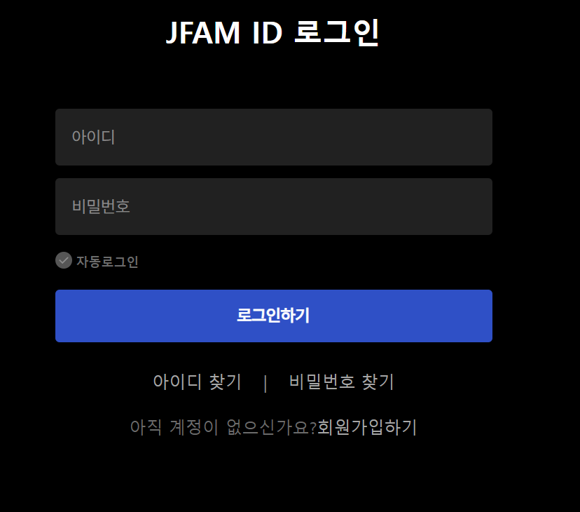
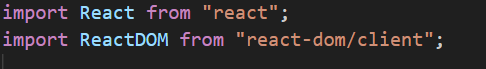
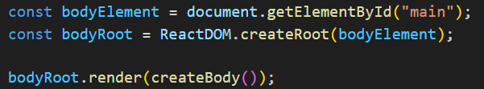
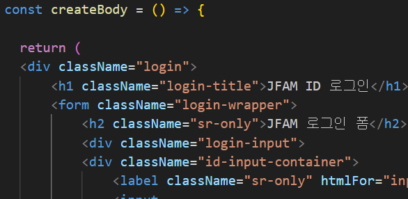

## 스크린샷



## 어려웠던 점

- 처음에 마크업을 어떻게 해야 할지 막막했다. 여태까지 마크업을 할 때는 내가 편한대로 부분을 나눌 수 있어서 좋았는데 JS와 HTML이 동시에 들어가야 한다고 생각하니 더 어려웠던 것 같다. 우선은 JS가 아니라 마크업만 하는 단계기 때문에 메인 코드를 통째로 가져왔는데, 그렇게 가져오니까 가독성이 떨어지는 것 같다.
- 경로를 설정하고 이어주는 과정이 조금 헷갈렸다. 처음에는 main.js를 사용하려고 했으나 결국 한 번에 main.jsx로 불러오게 되어서 아쉬웠다. 
- 내일은 시간이 없어서 조금 급하게 만든 감이 있는데 시간이 있다면 헤더나 푸터도 넣어보고 싶다.
- 특히 폴더에 파일을 넣을 때 public 안에 있는 파일들은 파일명이 바뀌지 않게 되고, src 폴더 안에 있는 파일들은 파일이 바뀌게 된다. 팀 프로젝트를 진행할 때도 이 기준이 자꾸만 헷갈렸던 것 같은데 잘 구별해서 넣어야겠다는 생각이 들었다. 

## 과제 시간
2024.1.20(토) 7:00PM ~ 11: 00PM

## 회고 
처음 환경 설정과 경로에서 오히려 어려움을 느꼈는데 회고조 팀원분들과 프로젝트 팀원분들이 도와주셔서 설정을 마칠 수 있었다. 오히려 여러 가지 오류들을 보면서 환경 설정에 대한 다양한 정보를 얻을 수 있었다. 생각보다 JSX 문법이 어렵지 않아서 당황했다. 실제로 랜더링 이후에 개발자 도구에서 틀린 문법은 다 집어줬기 때문에 오류를 수정하는 과정도 금방 끝났다. 실제 코드보다 환경설정하는 과정과 경로 문제에서 한 번 꼬이니까 수정하는 과정이 더 오래 걸렸던 것 같다. 

## 사용한 도구 및 웹사이트
- Visual Studio Code 
- 크롬 개발자 도구
- 리액트 공식 문서 (https://developer.mozilla.org/ko/docs/Learn/Tools_and_testing/Client-side_JavaScript_frameworks/React_getting_started)

## 개발 과정

### 1.1. 기본 환경 설정

기본 설정을 해주기 위해서 Vite를 활용했다. 터미널에 vite, react, react-dom을 차례대로 아래 명령어를 입력하여 설치하였다.

```pnpm add vite -D```

```pnpm add react```

```pnpm add react-dom```

package.json의 scripts에 명령어를 추가하여 dev를 입력할 때 바로 페이지를 열 수 있도록 하였고, 

```"scripts": {"dev": "vite"}```

.gitignore 파일에 

```node_modules  .env``` 

두 가지를 무시하도록 설정하여 기본 환경 설정을 마쳤다. 

### 1.2. JSX 파일 설정

우선 리액트와 리액트돔을 그림처럼 불러온다.



html 태그를 잡아올 수 있는 요소와 createBody라는 함수를 하단부에 선언한다. 또한 랜더링이 될 수 있도록 .render를 사용하여 함수를 호출한다.



함수 안에는 다음처럼 들어갈 HTML 코드를 넣어주었다. 주로 바꿨던 코드는 class를 className으로 바꿨던 것과 불필요한 코드를 삭제했고 카멜 케이스를 사용하도록 전부 바꿔주었다. 나머지 오류들은 개발자 도구에 뜨는 오류들을 확인하고 바꿔주었다. 

