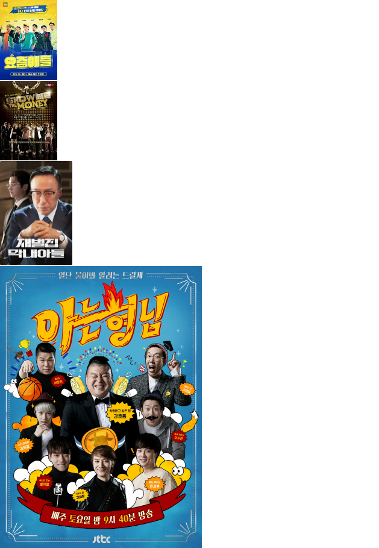
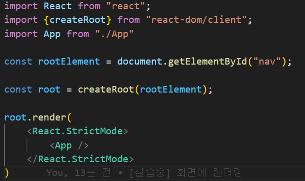
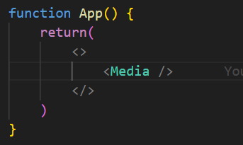
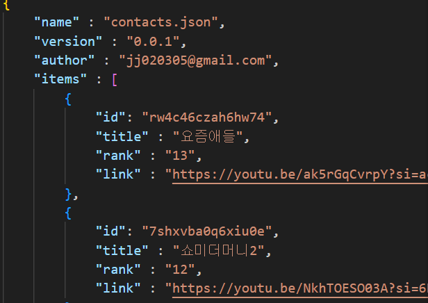
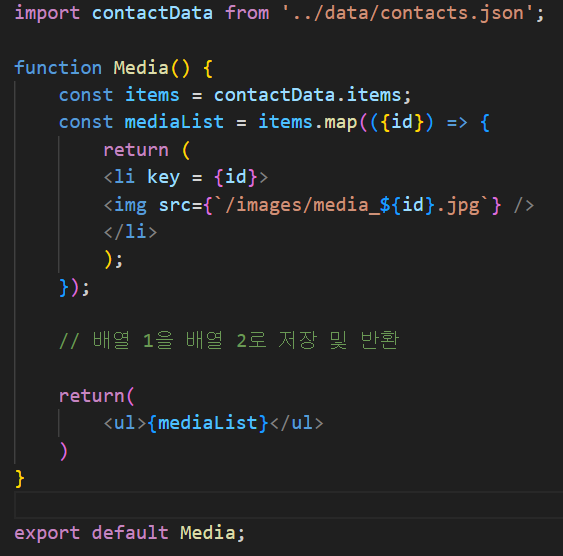

## 스크린샷



## 어려웠던 점
- contacts.json을 처음 사용해봐서 어떻게 사용해야 할지 헤매게 되었다. pockethost에 있는 속성과 아이디를 그대로 넣어서 랜더링하면 된다는 것을 알게 된 이후에는 여러 데이터들을 한 번에 넣기 좋다는 생각이 들었다. 과거 바닐라 프로젝트를 할 때도 하나씩 넣느라 무척 힘들었는데 실제로 랜더링 하는 것이 더 편해진 것 같다.
- 매우 간단하게만 과제 수행을 해서 map과 props를 공부하고 이용했는데 map 메소드를 사용했을 때 배열을 새로운 배열로 저장하여 랜더링할 수 있다는 것을 알게 되었다. 
- 뭔가 매번 코드를 읽기만 하다가 직접 하나씩 쳐보고 파일 경로 연결하는 것이 이번에도 역시나 어려웠다. 회고조 팀원분이 사실 리액트는 파일 연결하는 것이 가장 문제라고 하셨는데 매우 동의한다. main과 app, media를 차례차례 연결하고 html과 css를 또 연결해주면서 무척 헷갈렸다. 헷갈리지 않게 파일 경로를 잘 보고 연결해야겠다. 

## 과제 시간

2024.1.29 11:00 PM~ 12: 30 PM 

## 사용한 도구 및 웹사이트

## 개발 과정

### 1.1. 환경 설정

``` pnpm add vite -D ```

```pnpm add @vitejs/plugin-react -D ```

```pnpm add eslint -D```

```pnpm add react```

```pnpm add react-dom```

- 기본적으로 들어가야 할 환경 설정과 필수로 설치해야 하는 리액트 요소를 설치했다. 그외에도 .gitignore과 .prettierrc와 .eslint는 직접 야무쌤 깃허브를 참고하여 파일을 생성하였다.

### 2.1. 실습 과정



우선 main.jsx 에서 app을 랜더링해주었다. 수업 시간에 배운 StrictMode를 활용하여 문제점을 더욱 발견하기 쉽게 설정해주었다.



App.jsx에서는 Media 를 연결해주었다. 하나씩 차근차근 함수를 연결해주려고 노력했다. 이후에는 contacts.json에서 사용할 데이터를 설정해주었다. 프로젝트에서 사용했던 미디어의 썸네일과 영상 링크, 이미지를 가져와서 각자 다른 아이디로 넣어주었다.



Media.jsx에서 연결해준 데이터를 불러오고 미디어 함수를 통해서 map 메소드를 활용했다. map 메소드를 활용하면 새로운 배열로 저장할 수 있기 때문에 결국 저장한 모든 이미지 데이터들을 랜더링할 수 있게 된다. 그렇게 모든 이미지들을 반환할 수 있게 되었다. 


## 회고

- 크게 한 것은 없지만 파일 경로 설정과 어떻게 랜더링을 해줘야 하는지, 그리고 수업 시간에 배웠던 StrictMode나 Map 메소드 등등을 활용해볼 수 있는 실습이라 좋았다. 사실 수업 시간에도 따라 치느라 바쁘거나 모를 때는 푸쉬로 손놓고 있었던 아쉬운 경우가 많았는데 직접 과제를 하고 실습할 시간이 주어지니까 좋았다. 
- 다른 팀원의 파일을 프로젝트 때 이렇게까지 살필 기회가 없었는데 이번에 살필 기회가 생겨서 좋았다. 특히나 이번주 수업 시간에 컨디션 저하 때문에 과제를 밀려서 하느라.. 급하게 한 감이 있어서 아쉽다.
- 시간이 날 때 다시 CSS로 랜더링 된 데이터를 정리할 생각이다. 보다시피 reset.css 를 활용해서 정리만 해주고 제대로 정렬조차 하지 못했기 때문에.. 내일 회고 시간에 다시 정렬해볼 생각이다. 